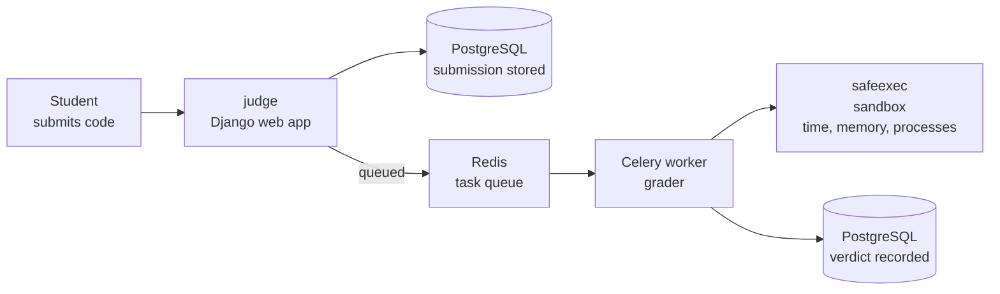

  
  <h1>UPR-Rank</h1>
  
<strong>Online judge for the Universidad de Pinar del Río</strong> 
  Competitive programming practice, grading and evaluation.

  

    
    
    
    
    
  

---

## Repositories

| Repository | What it is |
| --- | --- |
| [judge](https://github.com/UPR-Rank/judge) | The online judge: a Django site for contests, problems and submissions, plus the grader that compiles and runs each submission in a sandbox and records its verdict. |
| [safeexec](https://github.com/UPR-Rank/safeexec) | The sandbox that runs a submission under time, memory and process limits, as an unprivileged user. |
| [testlib](https://github.com/UPR-Rank/testlib) | Libraries for writing the checkers that decide whether a submission's output for a test case is correct. |
| [gcc-11.3.0](https://github.com/UPR-Rank/gcc-11.3.0) | A pinned gcc build used by the grader image to compile submissions the same way everywhere. |
| [runexe](https://github.com/UPR-Rank/runexe) | An old Windows program launcher. Unused: the judge runs on Linux and uses `safeexec`. |

## How a submission is graded

Each submission is stored in PostgreSQL and handed to a background worker through a
Redis queue. The worker compiles and runs the code inside the `safeexec` sandbox,
compares the output with the expected answer using the checkers in `testlib`, and
writes the verdict back to the database.

---

  <em>En honor a Ali Landeiro Gongora.</em>

